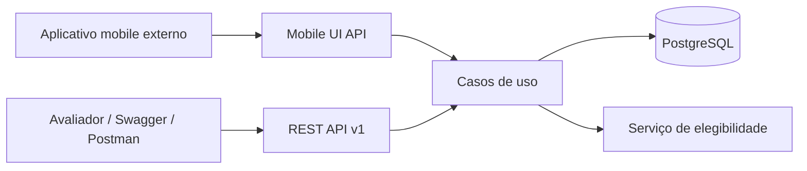
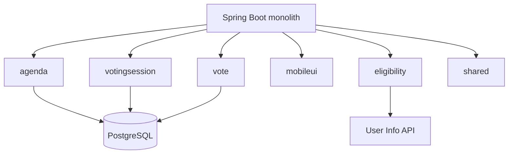

# Arquitetura

## Contexto e limites

O sistema atende o avaliador via REST/Swagger e um aplicativo mobile externo via
JSON dirigido pelo servidor. Ambos usam o mesmo backend. O PostgreSQL é a fonte de
verdade e um serviço HTTP opcional decide a elegibilidade do associado.





## Organização interna

Cada funcionalidade contém apenas as camadas necessárias:

```text
Controller → Application Service → Domain → Spring Data Repository → PostgreSQL
```

`agenda` mantém pautas; `votingsession` mantém janela e estado temporal; `vote`
registra e agrega votos; `eligibility` isola HTTP externo; `mobileui` compõe telas
e URLs; `shared` contém rotas, configuração, erros e correlação.

Há interfaces somente nas fronteiras reais: repositórios Spring Data e gateway de
elegibilidade. `ApiRoutes` centraliza apenas caminhos públicos, evitando
divergência entre controllers, testes e URLs mobile.

## Consistência e concorrência

O serviço faz uma consulta amigável antes do voto, mas a correção não depende
dela. A transação executa `INSERT`/flush e transforma a violação da constraint
única em `409`. Assim, duas requisições concorrentes não conseguem persistir dois
votos do mesmo associado.

A sessão não muda de coluna de estado: `NOT_STARTED`, `OPEN` ou `CLOSED` é
calculado a partir de `Clock` e dos timestamps. Isso elimina scheduler e estados
persistidos inconsistentes.

## Tecnologias

Java 21, Spring Boot Web/Validation/Data JPA/Actuator, PostgreSQL, Flyway,
springdoc-openapi, Maven, Testcontainers, WireMock, JaCoCo, Spotless, Docker e k6.

Não foram usados microsserviços, mensageria, Redis, CQRS, Kubernetes, autenticação
ou frontend. Eles aumentariam operação e superfície de falha sem resolver uma
necessidade do escopo.

## Trade-offs

- uma sessão por pauta simplifica voto e resultado, mas impede reabertura;
- UUID facilita geração distribuída e URLs opacas, com índice maior que bigint;
- retorno de confirmação mobile no endpoint de voto favorece o cliente descrito;
- ausência de retry evita alterar uma decisão externa não determinística, mas uma
  indisponibilidade temporária chega ao cliente como `503`;
- monólito reduz custo operacional, mas exige disciplina nos limites de módulos.
