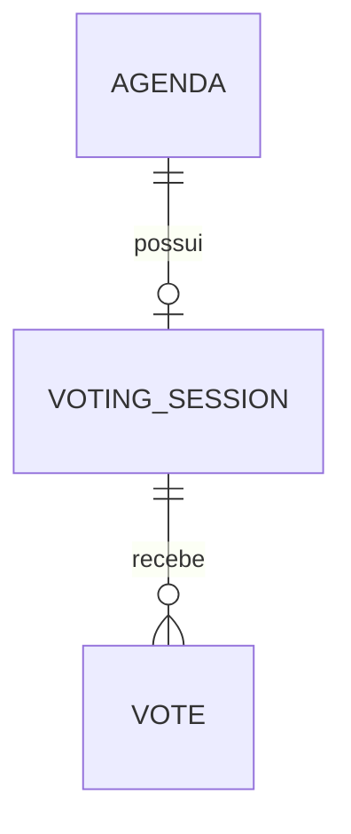

# Modelo de dados

## Visão geral

`Agenda` descreve a matéria votada. Cada pauta possui zero ou uma
`VotingSession`, que recebe zero ou muitos `Vote`.

## Entidades

### `agendas`

| Coluna | Tipo | Regra |
|---|---|---|
| `id` | UUID | PK |
| `title` | varchar(150) | not null |
| `description` | varchar(2000) | opcional |
| `created_at` | timestamptz | not null |

### `voting_sessions`

| Coluna | Tipo | Regra |
|---|---|---|
| `id` | UUID | PK |
| `agenda_id` | UUID | FK, not null, unique |
| `opened_at` | timestamptz | not null |
| `closes_at` | timestamptz | not null, maior que abertura |
| `requested_duration_seconds` | bigint | positivo |
| `created_at` | timestamptz | not null |

O estado é derivado: antes de `opened_at`, `NOT_STARTED`; de `opened_at` inclusivo
até `closes_at` exclusivo, `OPEN`; depois, `CLOSED`.

### `votes`

| Coluna | Tipo | Regra |
|---|---|---|
| `id` | UUID | PK |
| `session_id` | UUID | FK, not null |
| `associate_id` | varchar(64) | not null |
| `choice` | varchar(3) | check `SIM`/`NAO` |
| `created_at` | timestamptz | not null |

`UNIQUE (session_id, associate_id)` garante voto único mesmo sob concorrência.
Os índices `votes_session_id_idx` e `votes_session_choice_idx` suportam busca e
agregação `GROUP BY choice`.

UUID foi escolhido para IDs opacos, gerados na aplicação sem sequência global. O
custo é um índice maior; aceitável para o volume do desafio.

## Exemplo conceitual

Uma pauta `A` referencia uma sessão `S` aberta às 16:00 e encerrada às 16:05. Os
votos `(S, 12345678901, SIM)` e `(S, 10987654321, NAO)` são válidos; outro registro
com `(S, 12345678901, *)` viola a unicidade.

## Migrations

`V1__create_voting_schema.sql` cria as três tabelas, FKs, checks, constraints
únicas e índices. O Hibernate usa `validate`: Flyway, e não JPA, é responsável por
evoluir o schema.
