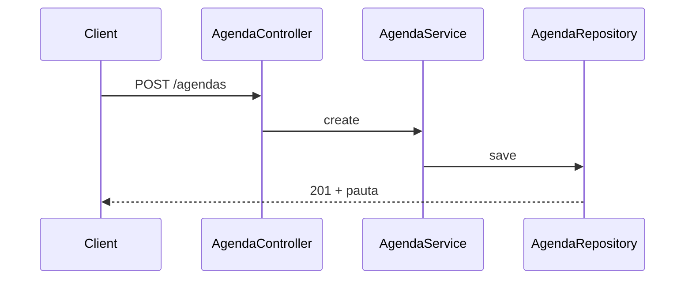
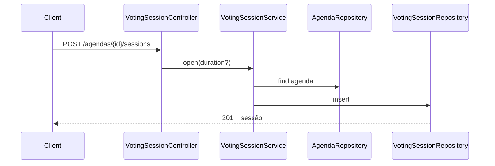
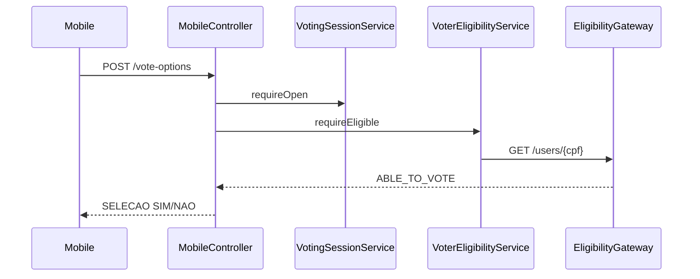
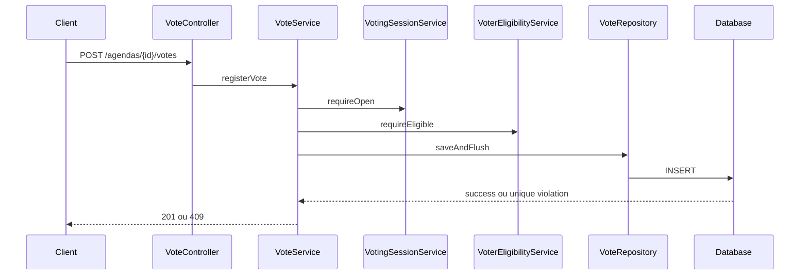

# Fluxos funcionais

## 1. Cadastrar pauta

Pré-condição: request válido. `POST /api/v1/agendas` valida título, cria UUID e
timestamp, insere `agendas` e retorna `201` com `Location`. Título vazio ou acima
de 150 caracteres retorna `400`.

## 2–3. Abrir sessão padrão ou customizada

Pré-condições: pauta existente e sem sessão. `POST
/api/v1/agendas/{id}/sessions` usa 60 segundos quando o body ou
`durationMinutes` é omitido; com valor, aceita 1–1440 minutos. Persiste abertura,
fechamento e duração. Pauta ausente retorna `404`, duração inválida `400` e segunda
sessão `409`. A constraint única protege requisições concorrentes.

## 4. Listar pautas mobile

`GET /api/v1/mobile/agendas` lista pautas e monta uma tela `SELECAO`. Cada item
leva à identificação e inclui `agendaId`; a origem da URL é `PUBLIC_BASE_URL`.
Não altera o banco.

## 5–7. Identificar, verificar elegibilidade e apresentar opções

`POST /api/v1/mobile/agendas/{id}/identify` confirma a pauta e retorna
`FORMULARIO` com `INPUT_TEXTO`. `POST .../vote-options` valida CPF, exige sessão
aberta e chama o gateway quando habilitado. `ABLE_TO_VOTE` produz `SELECAO` com
`SIM`/`NAO`; `UNABLE_TO_VOTE`/CPF inválido produz `422`; falha externa produz
`503`. Não há retry.

## 8–10. Registrar ou rejeitar voto

`POST /api/v1/agendas/{id}/votes` busca a sessão e calcula o estado com o relógio.
Se aberta, verifica elegibilidade e duplicidade, insere dentro de transação e
retorna `201` com tela `FORMULARIO` de confirmação. Sessão inexistente, futura ou
encerrada retorna `409`.

Para duplicidade, a consulta antecipada gera erro amigável; sob corrida, o
`UNIQUE(session_id, associate_id)` rejeita todos exceto um e
`DataIntegrityViolationException` vira `409 DUPLICATE_VOTE`.

## 11. Consultar resultado

`GET /api/v1/agendas/{id}/results` executa `GROUP BY choice`. Durante a janela,
retorna contagem parcial e `IN_PROGRESS`. Depois, compara os totais:
`APPROVED`, `REJECTED` ou `TIED`. Não altera o banco. Pauta ausente retorna `404`;
sessão ausente retorna `409`.

## 12. Indisponibilidade externa

Timeout, 5xx, erro de transporte ou payload desconhecido são normalizados como
`SERVICE_UNAVAILABLE`, registrados sem CPF e devolvidos como `503
ELIGIBILITY_UNAVAILABLE`. A operação não persiste voto e não libera o associado
silenciosamente.

Todos os erros incluem `ProblemDetail`, timestamp, código e `correlationId`.
